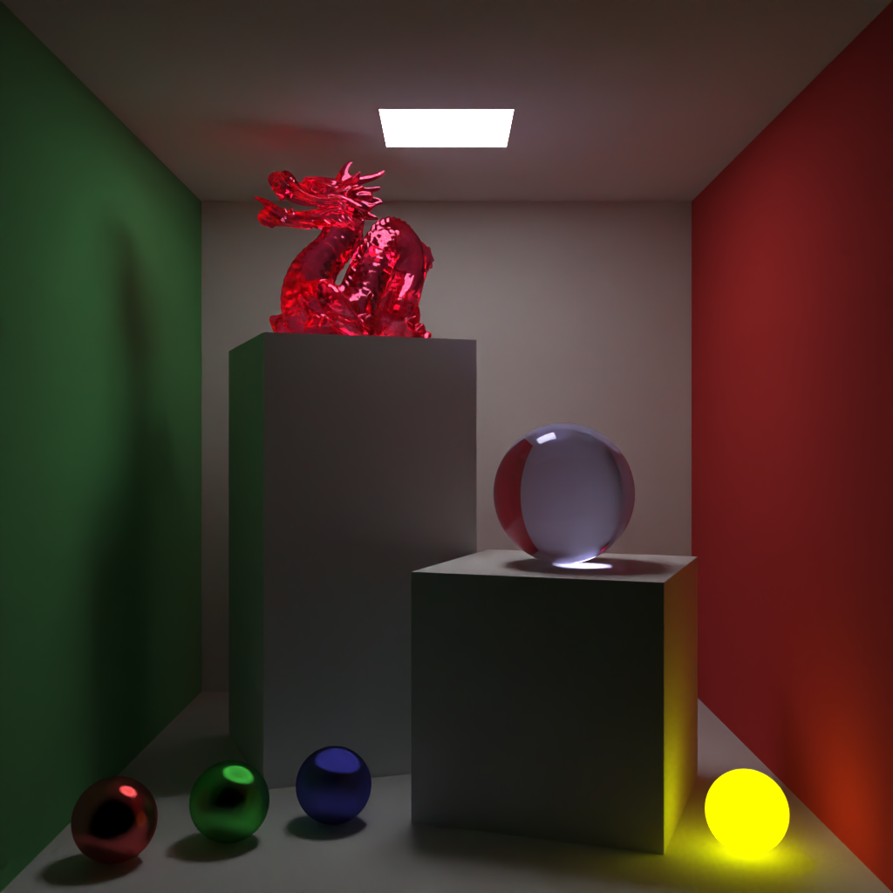
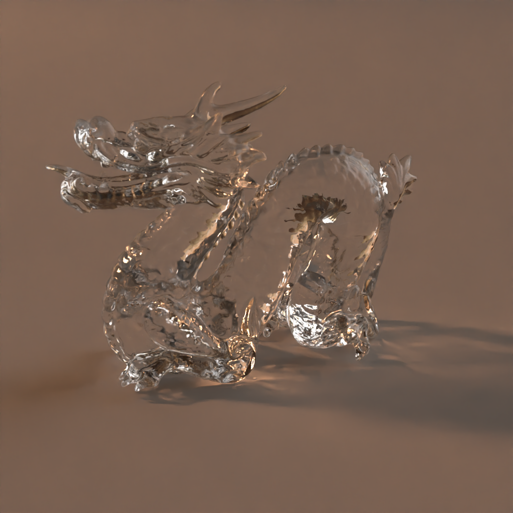
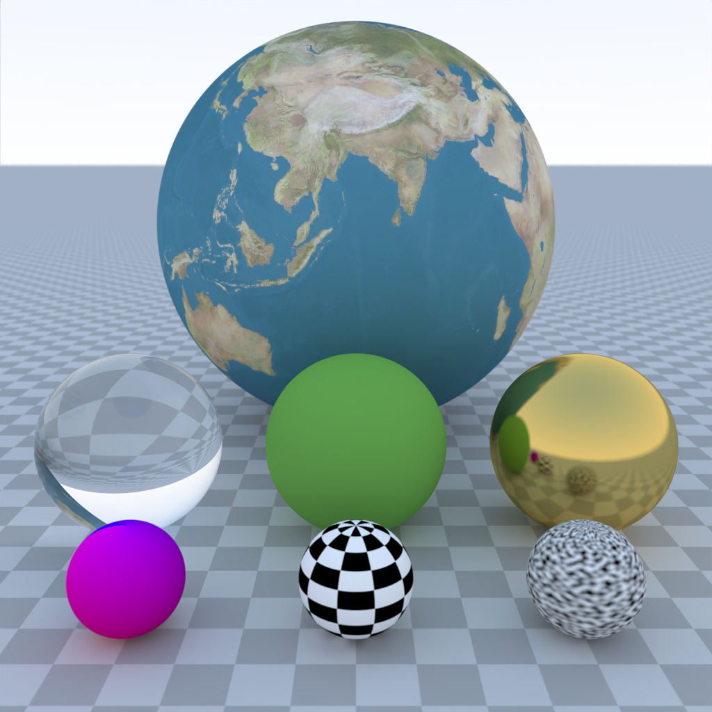
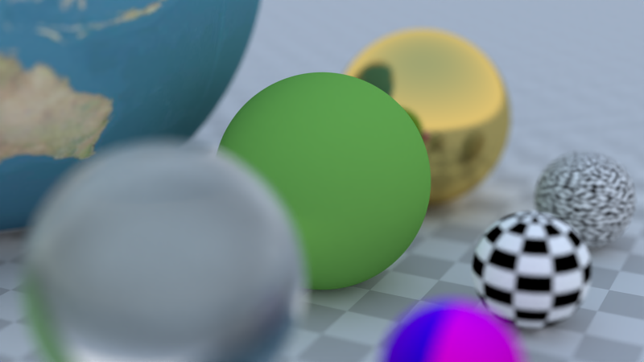

# Example Renderings

## Cornell Box

*256 SPP, 1.4b rays, 25s, 55m RPS*¹

## Suzanne

*256 SPP, 550m rays, 11s, 50m RPS*¹

## Dragon

*256 SPP, 730m rays, 17s, 40m RPS*¹

## Material Demo

*256 SPP, 700m rays, 8s, 80m RPS*¹

## Many Spheres

*256 SPP, 260m rays, 4s, 70m RPS*¹

## Defocus Blur

*256 SPP, 340m rays, 5s, 75m RPS*¹

---

¹ Timing & performance stats are measured on an 8-core AMD Ryzen 7 7800X3D
